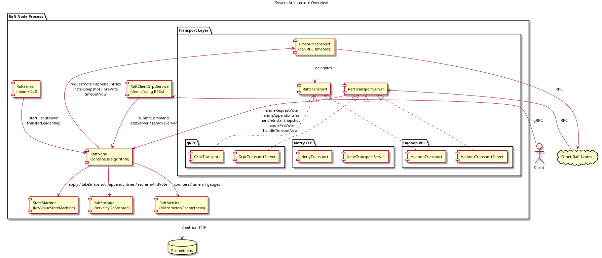
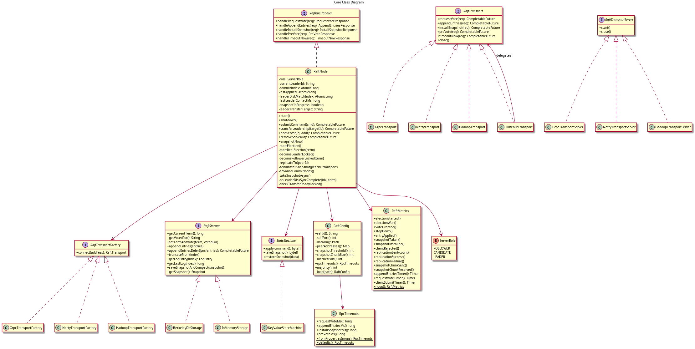
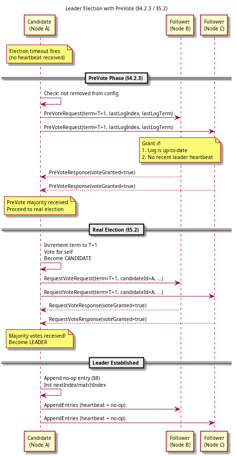
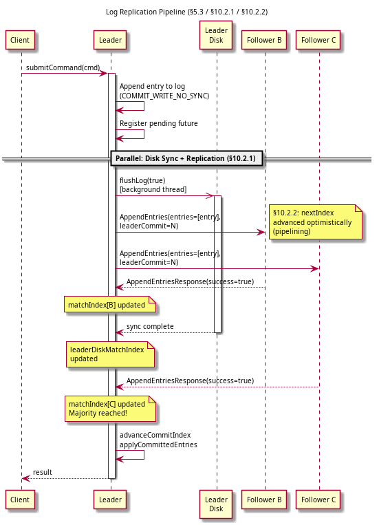
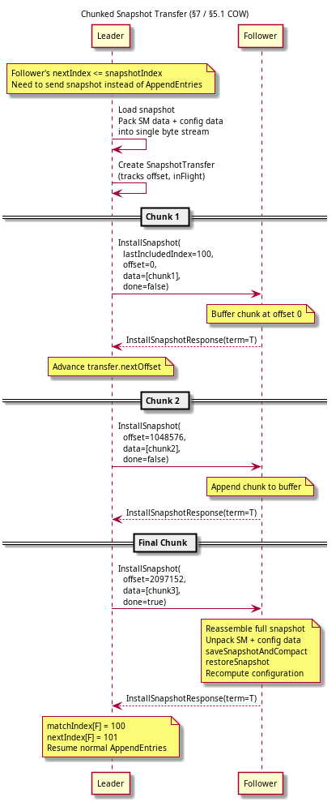

# 1. Overview

**fbtberger-raft** is a from-scratch Java 17 implementation of the Raft consensus algorithm,
following Ongaro & Ousterhout's *"In Search of an Understandable Consensus Algorithm"*
and the PhD dissertation *"Consensus: Bridging Theory and Practice"*.

The project implements:

- **Core Raft** (§5): leader election, log replication, safety rules
- **Leadership transfer** (§3.10): graceful handoff via TimeoutNow RPC
- **Cluster reconfiguration** (§6): single-step changes (`addServer`/`removeServer`) and joint consensus (`setConfiguration`) for arbitrary multi-server changes (with §4 errata fix)
- **Log compaction** (§7): independent snapshotting with chunked InstallSnapshot
- **Client interaction** (§8): no-op entry, leader redirection
- **Linearizable reads**: ReadIndex protocol (`readIndex()`) and lease-based reads (`leaseRead()`) for zero-round-trip reads under stable leadership
- **PreVote + Leader Stickiness** (§4.2.3 / §9.6): prevents partitioned servers from disrupting the cluster; `hasLeaderStickiness()` denies votes when a valid leader is active
- **Performance optimizations** (§10.2): parallel leader disk writes, batching, pipelining
- **Copy-on-write snapshotting** (§5.1): `prepareCowSnapshot()` captures state under the lock; serialization runs on a background thread
- **Transport abstraction**: pluggable gRPC, Netty TCP, and Hadoop RPC with per-RPC timeouts and TLS/mTLS
- **Storage**: BerkeleyDB JE, append-only WAL, or in-memory (pluggable via `RaftStorage`)
- **Observability**: SLF4J/Logback logging, Micrometer metrics (Prometheus + JMX), health checks, JMX MBean

\newpage

# 2. System Architecture

{width=100%}

Each Raft node runs as a single JVM process. The **RaftNode** class owns the
consensus algorithm. It delegates durable storage to **RaftStorage** (backed by
Berkeley DB JE, a segmented WAL, or in-memory for tests), state machine
operations to **StateMachine**, and peer communication to the **Transport**
abstraction layer.

The transport layer is pluggable: **gRPC** (default, HTTP/2 + protobuf),
**Netty** (raw TCP with custom framing), or **Hadoop RPC** (WritableRpcEngine
with BytesWritable-wrapped protobuf). A **TimeoutTransport** decorator applies
per-RPC configurable timeouts to any transport implementation.

Logging uses SLF4J with Logback. Prometheus metrics are exposed via Micrometer
counters, timers, and gauges on a configurable HTTP endpoint.

\newpage

# 3. Class Diagram

{width=100%}

Key design principles:

- **RaftNode** implements `RaftRpcHandler`, making it transport-agnostic
- All dependencies are injected (Spring IoC in production, manual wiring in tests)
- `RaftStorage` separates durable state from the algorithm
- `RaftTransport` / `RaftTransportFactory` abstract the network layer
- `TimeoutTransport` decorates any transport with per-RPC timeouts
- `RaftMetrics` instruments all significant state transitions

\newpage

# 4. Leader Election with PreVote

{width=85%}

The election process has two phases:

1. **PreVote (§4.2.3)**: The candidate checks with a majority that they would
   grant a vote AND haven't heard from a valid leader recently. This prevents
   a partitioned server from incrementing its term and disrupting the cluster
   when it rejoins. The term is *not* incremented during PreVote.

2. **Real Election (§5.2)**: Only after PreVote succeeds does the candidate
   increment its term, vote for itself, and send `RequestVote` RPCs. On
   receiving a majority, it becomes leader and immediately appends a no-op
   entry (§8).

Single-node clusters skip PreVote and elect immediately.

# 5. Leadership Transfer (§3.10)

A leader can gracefully hand off to a specific target server:

1. **Stop accepting client requests** -- `submitCommand` returns
   `NotLeaderException` with the target as leader hint.
2. **Catch up the target** -- normal heartbeat replication continues until
   `matchIndex[target] >= lastLogIndex`.
3. **Send TimeoutNow** -- the target immediately starts a real election
   (skipping PreVote and election timeout), wins, and the prior leader
   steps down on seeing the higher term.
4. **Abort on timeout** -- if transfer doesn't complete within
   `ELECTION_TIMEOUT_MAX_MS`, the leader aborts and resumes normal operation.

```java
node.transferLeadership("n2").get(1, SECONDS);
```

# 5.1 Linearizable Reads (ReadIndex + Lease)

A local read from the state machine is not linearizable because the node may be
a stale leader (split-brain). Two mechanisms are provided:

**ReadIndex** (`readIndex()`): confirms leadership before allowing reads.

1. **Record** `readIndex = commitIndex` at the time of the call.
2. **Confirm leadership** by sending a heartbeat round to all peers and waiting
   for a majority to acknowledge (via successful `AppendEntries` responses).
3. **Wait** for `lastApplied >= readIndex` so the state machine is up to date.
4. **Complete** the future -- the caller can now read safely.

```java
node.readIndex().thenRun(() -> {
    String value = stateMachine.get("key"); // linearizable
});
```

**Lease-based reads** (`leaseRead()`): serves reads immediately (no heartbeat
round-trip) when the leader holds a valid lease -- i.e., a majority of peers have
acknowledged a heartbeat within the election timeout window. If the lease has
expired, falls back to `readIndex()` transparently.

```java
node.leaseRead().thenRun(() -> {
    String value = stateMachine.get("key"); // linearizable, zero RTT if lease valid
});
```

Lease reads assume bounded clock skew. Use `readIndex()` if clocks may diverge
significantly. Single-node clusters complete immediately for both methods.

# 5.2 Joint Consensus (§6)

In addition to single-step changes (`addServer`/`removeServer`), the system
supports arbitrary multi-server membership changes via joint consensus:

1. **Phase 1 (C\_old,new)**: The leader proposes a configuration entry containing
   both old and new member lists. During this phase, `advanceCommitIndex()`
   requires separate majorities from both old and new configurations via
   `hasSeparateMajorities()`.
2. **Phase 2 (C\_new)**: When C\_old,new commits, the leader automatically proposes
   C\_new (the final configuration with only the new members). Old-configuration
   nodes not in C\_new step down once this entry commits.

```java
node.setConfiguration(Map.of(
    "n1", "host1:9091",
    "n2", "host2:9092",
    "n5", "host5:9095"  // replaces n3
)).get(5, SECONDS);
```

\newpage

# 6. Log Replication Pipeline

{width=85%}

Three optimizations from §10.2 reduce latency:

1. **Parallel leader disk writes (§10.2.1)**: The leader writes entries with
   `COMMIT_WRITE_NO_SYNC` and replicates to followers immediately. A background
   thread calls `flushLog(true)` to fsync. The leader tracks its own durable
   progress via `leaderDiskMatchIndex` and only counts itself in the commit
   majority when the fsync is confirmed.

2. **Batching (§10.2.2)**: Each `AppendEntries` RPC carries up to 1 MB of
   entries, amortizing per-RPC overhead under high load.

3. **Pipelining (§10.2.2)**: After sending entries, the leader optimistically
   advances `nextIndex` so the next heartbeat tick can send subsequent entries
   without waiting for the previous ACK. A per-peer inflight counter (max 2)
   prevents unbounded pipelining. On failure, `nextIndex` reverts to the last
   confirmed `matchIndex + 1`.

\newpage

# 7. Snapshot Transfer

{width=85%}

Snapshots are handled in two parts:

**Taking snapshots (§5.1 COW)**: `StateMachine.prepareCowSnapshot()` captures a
lightweight copy-on-write reference under the Raft lock (e.g. a shallow `HashMap`
copy for `KeyValueStateMachine`). The returned `Supplier<byte[]>` is invoked on a
background thread to serialize the snapshot and persist it — neither serialization
nor disk I/O blocks the Raft lock. A staleness check prevents a background
snapshot from overwriting a more recent `InstallSnapshot`.

**Transferring snapshots (§7, Figure 13)**: The leader packs the state machine
data and cluster configuration into a single byte stream
(`[4B smLen][smData][cfgData]`) and sends it in fixed-size chunks (default 1 MB).
One chunk is sent per heartbeat cycle. The follower buffers incoming chunks and
applies the reassembled snapshot when the final chunk arrives (`done=true`).

\newpage

# 8. Transport Layer

The transport abstraction decouples RaftNode from any specific network library:

| Interface | Purpose |
|-----------|---------|
| `RaftTransport` | Outbound peer connection (5 RPCs) |
| `RaftTransportFactory` | Creates outbound connections from an address string |
| `RaftTransportServer` | Inbound server that routes RPCs to `RaftRpcHandler` |
| `RaftRpcHandler` | Handler interface (implemented by RaftNode) |
| `RpcTimeouts` | Per-RPC timeout configuration from `.properties` |
| `TimeoutTransport` | Decorator applying `orTimeout()` to any transport |
| `TlsConfig` | TLS/mTLS certificate paths and settings |

**RPCs**: RequestVote, AppendEntries, InstallSnapshot, PreVote, TimeoutNow.

**Implementations**:

| Transport | Protocol | Use case |
|-----------|----------|----------|
| gRPC (default) | HTTP/2 + protobuf | Standard deployments |
| Netty TCP | Length-delimited + protobuf | Lightweight, no HTTP overhead |
| Hadoop RPC | WritableRpcEngine + BytesWritable | Hadoop ecosystem integration |

**Per-RPC timeouts** are configurable via `.properties`:

```
rpc.timeout.request.vote.ms=1000
rpc.timeout.append.entries.ms=2000
rpc.timeout.install.snapshot.ms=30000
rpc.timeout.pre.vote.ms=1000
```

**TLS/mTLS**: gRPC and Netty transports support TLS encryption and mutual
authentication via `TlsConfig` (parsed from `.properties`). gRPC uses
`GrpcSslContexts` with shaded Netty; raw Netty uses `SslContextBuilder`.

# 9. Storage Layer

Three `RaftStorage` implementations are available:

| Implementation | Durability | Use case |
|----------------|-----------|----------|
| `BerkeleyDbStorage` | fsync (COMMIT\_SYNC) | Production default |
| `WalStorage` | Append-only WAL + fsync | Lightweight alternative |
| `InMemoryStorage` | None | Tests and demos |

**WalStorage** uses segmented append-only files (`wal-NNNNNN.log`) with CRC32-checked
frames (`[4B length][4B CRC32][protobuf bytes]`). Each segment has a configurable
maximum size (default 64 MB); a new segment is started when the active segment
exceeds the limit. An in-memory index (log index to segment + file offset) is
rebuilt on recovery by scanning all segments sequentially; frames with CRC32
mismatches are truncated. Metadata (term/vote) and snapshots are stored in
separate files, atomically replaced via rename. Supports deferred fsync (§10.2.1)
via a background thread. Compaction deletes entire obsolete segments after a
snapshot rather than rewriting.

# 10. Errata Fix (§4)

The dissertation's single-server membership change algorithm has a known safety
bug: competing configuration changes across term boundaries in even-sized clusters
can use non-overlapping majorities. The fix (from the raft-dev mailing list):
a leader must commit an entry from its current term before accepting configuration
changes. The no-op entry appended at the start of every term (§8) serves this
purpose -- `addServer`/`removeServer` are rejected until `commitIndex >= leaderNoOpIndex`.

# 11. Observability

**Metrics**: All significant Raft events are instrumented via Micrometer,
published to both **Prometheus** (`/metrics` HTTP endpoint) and **JMX**
(via `JmxMeterRegistry` and `CompositeMeterRegistry`):

**JMX MBean**: `RaftNodeMXBean` (`com.fbtberger.raft:type=RaftNode`) exposes
role, term, commitIndex, cluster members, and operations (triggerSnapshot,
transferLeadership) for JConsole/VisualVM.

**Health checks** on the metrics port:

- `GET /health` — liveness, always 200
- `GET /ready` — readiness, 200 when leader is known, 503 during elections

**Metrics table**:

| Metric | Type | Description |
|--------|------|-------------|
| `raft.election.started` | Counter | Elections initiated |
| `raft.election.won` | Counter | Elections won |
| `raft.vote.granted` | Counter | Votes granted to candidates |
| `raft.stepdown` | Counter | Step-downs to follower |
| `raft.entry.applied` | Counter | Entries applied to state machine |
| `raft.replication.sent` | Counter | Entries sent to followers |
| `raft.replication.success` | Counter | Successful AppendEntries responses |
| `raft.replication.failure` | Counter | Failed AppendEntries (log mismatch) |
| `raft.snapshot.taken` | Counter | Snapshots taken |
| `raft.snapshot.installed` | Counter | Snapshots installed from leader |
| `raft.snapshot.chunk.sent` | Counter | Snapshot chunks sent |
| `raft.snapshot.chunk.received` | Counter | Snapshot chunks received |
| `raft.client.rejected` | Counter | Client submissions rejected (not leader) |
| `raft.rpc.append.entries` | Timer | AppendEntries RPC handling time |
| `raft.rpc.request.vote` | Timer | RequestVote RPC handling time |
| `raft.rpc.install.snapshot` | Timer | InstallSnapshot RPC handling time |
| `raft.client.submit` | Timer | Client submit-to-commit time |
| `raft.node.term` | Gauge | Current Raft term |
| `raft.node.commit.index` | Gauge | Highest committed log index |
| `raft.node.last.applied` | Gauge | Last applied log index |
| `raft.node.role` | Gauge | Current role (0=follower, 1=candidate, 2=leader) |
| `raft.node.log.last.index` | Gauge | Index of the last log entry |
| `raft.node.snapshot.index` | Gauge | Snapshot boundary (last compacted index) |
| `raft.cluster.size` | Gauge | Number of nodes in configuration |
